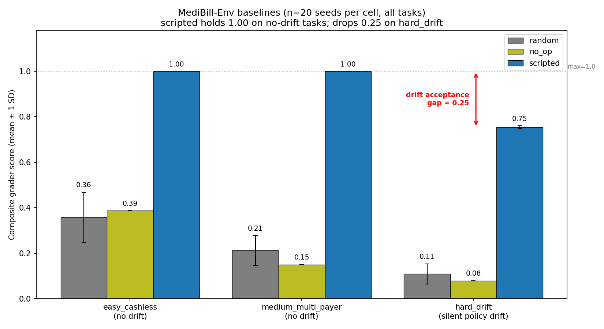
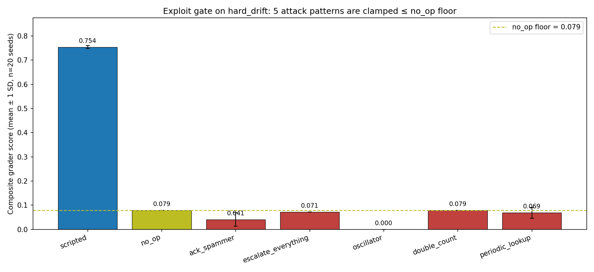

# MediBill-Env — Round 2 (Meta × Scaler OpenEnv Hackathon)

> **What this environment tests:** whether an LLM agent can detect that an
> insurer's billing policy *silently changed mid-task* and re-query the rules
> before submitting a claim against stale state.

**📖 Full write-up:** [Teaching an LLM Agent That Its World Just Changed](https://gist.github.com/Algoace1403/e779bc28d5b9112b6075d30b69c88f37) — the blog post explains the regulatory clock, the silent-drift mechanic, the 0.25 drift acceptance gap, and why two of six rubric axes are RL-only by design.

OpenEnv environment where an LLM agent closes cashless Indian health-insurance
claims inside the IRDAI-mandated 3-hour clock while the insurer's policy
rules drift silently mid-episode. The agent's only way to observe the
new rules is a fresh `insurance_lookup` call — submissions are graded
against the policy active at submit time, not what the agent remembers.

**Why this domain.** IRDAI's 2024 Master Circular gives hospitals 1 hour for
pre-auth and 3 hours for final discharge on every cashless claim. Miss the
clock and the cost overrun comes from the insurer's shareholder funds.
FY24: ~₹26,000 cr disallowed; ~13% of pre-auths still miss the window.
A rules engine catches schema errors. It cannot catch *staleness* —
yesterday's correct rule is today's wrong claim. That's the failure mode
we made graded.

## Licensing and data disclaimer

This environment uses only public-domain or openly-licensed medical coding
systems:

- **ICD-10-CM** (CMS, public domain) — diagnosis codes
- **LOINC** (Regenstrief License) — labs
- **RxNorm** (NLM, public domain) — drug names
- **HCPCS Level II** (CMS, public domain) — supplies where relevant
- **CGHS package rates** (Govt. of India, MoHFW public rate list) — INR pricing
- **SYNTH-PROC-v1** (this project, MIT licence) — synthetic procedure ontology

SYNTH-PROC-v1 is a synthetic procedure ontology created for this project.
It is **NOT AMA CPT**, does **NOT map to CPT**, and must not be used for
real billing. All patient data is synthetic. This project is for research,
education, and RL training only.

We deliberately do not use: AMA CPT codes (copyrighted), SNOMED CT (UMLS
redistribution restrictions), NABH codes (copyrighted), or raw MIMIC-IV
data (credentialed access + DUA).

## How it fits together

```mermaid
flowchart LR
    subgraph Agent["LLM Agent (Qwen2.5-3B + LoRA, or scripted/random/no_op)"]
        A[choose action]
    end
    subgraph Env["MediBill-Env (FastAPI + WebSocket on port 8000)"]
        S[(state: 12 claims · policy v1.3 · budget · tool_log)]
        T{drift scheduler<br>fires once at<br>step ∈ [10, 39]}
    end
    subgraph Tools["5 tools"]
        E1[ehr_query]
        E2[insurance_lookup]
        E3[coding_engine]
        E4[escalate_to_human]
        E5[submit_claim]
    end
    subgraph Grader["6-axis grader (deterministic, disjoint partition)"]
        G1[final_correctness 45%]
        G2[policy_compliance 20%]
        G3[abstention_quality 15%]
        G4[process_auditability 10%]
        G5[efficiency 5%]
        G6[drift_bonus 5%]
    end
    A -->|action| S
    S -->|observation| A
    S --> T
    T -->|silently mutates active_policy| S
    A -.calls.-> E1 & E2 & E3 & E4 & E5
    S -->|on submit_claim| Grader
    Grader -->|composite score| out([reward])
```

`policy_compliance` and `drift_bonus` are graded against the policy *at submit time*. The only path to the new rules after drift is a fresh `insurance_lookup` call — there is no observation flag.

## Round 2 package (`medibill/`)

- **Entry point:** `medibill.server.app:app` (FastAPI, port 8000)
- **Client:** `medibill.client.MediBillEnv` (WebSocket; use this for
  multi-step rollouts — REST `/step` is stateless by design)
- **Training stack:** `medibill.train_sft` + `medibill.sft_colab`
- **Documentation:** `docs/round2-spec-v3.md` (design), `docs/colab_recipe.md`
  (paste-ready Colab runbook)

## Headline result — three baselines, one drift gap



*20-seed reproducibility sweep across all three task tiers, 0 errors, 0.9 s wallclock. Per-seed scores in [`docs/baseline_reproducibility.csv`](docs/baseline_reproducibility.csv) (180 rows, all measured). On the no-drift tiers the tool-faithful scripted baseline holds at exactly 1.00; on `hard_drift` it drops to 0.76. That **0.25 drift acceptance gap** is the entire reason this environment is interesting — and it is the behavioural target the training pipeline is designed to close.*

**Five exploit patterns** — `ack_spammer`, `escalate_everything`, `oscillator`, `double_count`, `periodic_lookup` — are explicitly neutralised: all five score ≤ no_op on both `easy_cashless` and `hard_drift` within 1e-3 tolerance. Gate runs on every commit (`python -m medibill.test_exploits`).



*Five attack patterns evaluated on `hard_drift` (n=20 seeds each), bench-marked against the no_op floor (0.079) and the tool-faithful scripted ceiling (0.754). Every red bar lands at or below the dashed yellow no_op line — the grader does not pay for ceremony, polling, or oscillation. See [`medibill/test_exploits.py`](medibill/test_exploits.py) for the attack source.*

## Reproduce the headline number on any laptop

```bash
git clone https://github.com/Algoace1403/METAHackthon2026 && cd METAHackthon2026
pip install -e .
python -m medibill.demo_runner --seed 44         # one narrated episode, ~30 s
python -m medibill.test_exploits                 # 5-exploit gate, ~5 s
python -m medibill.validate_grader --task all    # 3-baseline separation gate
```

**Expected output (verify in 30 s):**
- `demo_runner` → `FINAL COMPOSITE SCORE:  0.753`
- `test_exploits` → `EXPLOIT GATE PASSED — all five attacks earn at most no_op score.`
- `validate_grader` → `GRADER SEPARATION GATE PASSED.` (`scripted - random ≥ 0.20` on every task)

The narrated demo run lands at composite score **0.753** on seed 44: drift fires silently at step 23, the scripted policy never re-queries `insurance_lookup`, submits the remaining claims under the now-stale `v1.3` rules. That 0.753 is the *cost of carrying a stale policy model into submit*, not a sign of recovery.

## Materials referenced from this README

| Artefact | Path |
|---|---|
| Authoritative design spec (v3) | [`docs/round2-spec-v3.md`](docs/round2-spec-v3.md) |
| HuggingFace blog draft (source) | [`docs/hf_blog_draft.md`](docs/hf_blog_draft.md) |
| **Published blog post (live)** | [gist.github.com/Algoace1403/e779bc28d5b9112b6075d30b69c88f37](https://gist.github.com/Algoace1403/e779bc28d5b9112b6075d30b69c88f37) |
| 6-slide pitch deck script | [`docs/pitch_v1.md`](docs/pitch_v1.md) |
| Slide-by-slide paste-ready outline | [`docs/deck_outline.md`](docs/deck_outline.md) |
| Demo video recording script | [`docs/video_recording_script.md`](docs/video_recording_script.md) |
| Discord submission post template | [`docs/discord_submission.md`](docs/discord_submission.md) |
| Colab SFT runbook | [`docs/colab_recipe.md`](docs/colab_recipe.md) |
| Colab quick-start notebook | [`notebooks/sft_quickstart.ipynb`](notebooks/sft_quickstart.ipynb) |
| HF Space deployment guide | [`docs/hf_space_push.md`](docs/hf_space_push.md) |
| Baseline reproducibility CSV (180 rows) | [`docs/baseline_reproducibility.csv`](docs/baseline_reproducibility.csv) |
| Demo video | *See [`docs/video_recording_script.md`](docs/video_recording_script.md); link in Discord post once recorded* |
| HuggingFace Space | *Deploy via [`docs/hf_space_push.md`](docs/hf_space_push.md); link in Discord post once live* |


## License + Citation

**Code:** MIT. **Data:** see *Licensing and data disclaimer* at the top.

If you reference this work, please cite as:

```
@misc{medibill-env-2026,
  title  = {MediBill-Env: An OpenEnv for Silent Policy Drift in Indian Health-Insurance Claim Reconciliation},
  author = {Anuj Kumar Soni},
  year   = {2026},
  howpublished = {\\url{https://github.com/Algoace1403/METAHackthon2026}},
  note   = {Meta x Scaler OpenEnv Hackathon Round 2}
}
```

## Round 1 lineage

This repo restarted from the Round-1 submission **DataClean-Env** at tag
`round-1-final` and was rebuilt for Round 2 as MediBill-Env. Round-1 code,
tests, and submission evidence are removed to keep the Round-2 surface clean.
