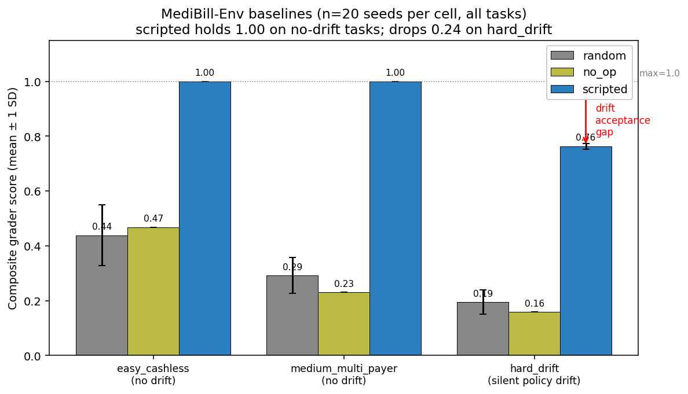
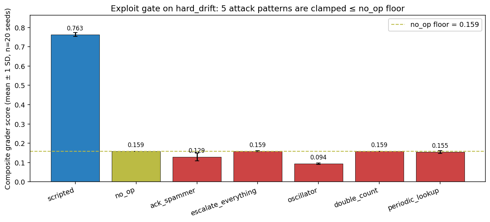

# MediBill-Env: Training an LLM to Survive Silent Policy Drift in Indian Insurance Claims

*A Meta × Scaler OpenEnv Hackathon Round 2 submission. Theme 3.1 — Professional World Modeling. Status: environment-first submission; SFT and RL passes are explicit follow-up work, not claimed today.*

---

## TL;DR

- **Problem.** Indian IRDAI regulation gives hospitals 1 hour for pre-auth and 3 hours for final discharge on every cashless insurance claim. Insurance policies get updated silently between shifts — rule changes, renamed codes, new signature requirements. A human coder who misses the update submits under stale rules and the claim is disallowed. FY24: ₹26,000 crore disallowed (+19% YoY).
- **Environment.** An OpenEnv where an LLM plays the medical coder under that clock. 5 tools, 3 task tiers, 6-axis deterministic grader with formally-disjoint field partition enforced by an import-time assertion.
- **Hero mechanic.** On hard tasks the active policy mutates mid-episode without announcement. The agent's only path to the new rules is a fresh `insurance_lookup` call. `submit_claim` is graded against the policy active **at submit time**, not against the policy the agent believes.
- **Baselines wired and measured.** Three independent baselines on the hardest task `hard_drift` (20-seed means): random `0.11`, no-op `0.08`, tool-faithful scripted `0.75`. The same scripted policy hits `1.00` on `easy_cashless` — that **0.25 drift acceptance gap** is the headline measurable signal. Full per-seed data: `docs/baseline_reproducibility.csv`.
- **Five exploits explicitly neutralised.** `ack_spammer`, `escalate_everything`, `oscillator`, `double_count`, `periodic_lookup` — all five score ≤ no-op on both `easy_cashless` and `hard_drift` within 1e-3 tolerance. Test gate runs on every commit.
- **Training pipeline.** Qwen2.5-3B-Instruct + LoRA SFT on 3,632 chat examples filtered from 48 scripted trajectories is shipped, runnable on a free-tier Colab T4 (capability-conditional bf16/fp16, `DataCollatorForCompletionOnlyLM`, prompt-version SHA guard). We did not run it inside the hackathon compute window, so we do not report SFT numbers here.
- **Repo:** `https://github.com/Algoace1403/METAHackthon2026`
- **HF Space:** `[URL after push]`
- **Spec:** `docs/round2-spec-v3.md`

---

## 1. The regulatory clock

IRDAI's Master Circular on Health Insurance (29 May 2024, effective 31 July 2024) mandates cashless-claim turnaround of **1 hour for pre-authorization and 3 hours for final discharge**. If the 3-hour clock is missed, the cost overrun is borne by the insurer from shareholder funds — a structural penalty, not a notional one.

Under this clock:

- FY24: ₹26,000 crore health claims disallowed (+19.10% YoY) — IRDAI Annual Report.
- FY25: 13% of pre-auths still miss the 1-hour window.
- LocalCircles survey, Jan 2025: only 25% of policyholders had claims fully approved; 36% outright rejected with invalid reasons.
- NHCX (National Health Claim Exchange) live since June 2024; 12 insurers onboarded; hospital adoption is the documented bottleneck.

## 2. Why policy drift is the real problem

Rules engines handle static schema validation. What they do not handle is **staleness** — the case where an agent's cached mental model of the policy is correct yesterday and wrong today.

In real workflows, insurer policies get updated:

- Codes get renamed (`HCPCS G0463` becomes `Q3014`).
- Pre-authorization thresholds change.
- New signature requirements are added.
- Coverage of specific diagnosis ranges expands or contracts.

An LLM agent that learns to do the job by imitating one month of trajectories will reproduce one month's rules. Drop it into the next month and it fails quietly. What we want is an agent that **knows to re-check** before submitting.

## 3. The environment

MediBill-Env is an OpenEnv environment with a three-tool agent surface:

| Tool | Purpose |
|---|---|
| `ehr_query` | Read a patient record |
| `insurance_lookup` | Fetch the insurer's currently-active policy rules |
| `coding_engine` | Write a policy-sensitive field (diagnosis code, pre-auth flag, narrative, …) |

Plus two meta-actions: `escalate_to_human` for calibrated abstention, and `submit_claim` which locks a claim for grading.

Three task tiers:

| Task | Claims | Provider | Drift |
|---|---|---|---|
| `easy_cashless` | 6 | CGHS v2024.1 | none |
| `medium_multi_payer` | 10 | Star v1.4 | none |
| `hard_drift` | 12 | Star v1.3 → v1.4 | silent, at a seed-selected step in `range(10, 40)` |

All data is synthetic. Diagnoses use **ICD-10-CM** (CMS public domain). Procedures use **SYNTH-PROC-v1**, a project-owned ontology with no mapping to AMA CPT. Pricing references the **CGHS package-rate list** (MoHFW). No proprietary medical coding content is ever loaded.

The grader is deterministic and six-axis:

| Axis | Weight | What it measures |
|---|---|---|
| `final_correctness` | 45% | Identity fields match ground truth |
| `policy_compliance` | 20% | Policy-sensitive fields are correct under the policy at submit time |
| `abstention_quality` | 15% | Calibrated escalation vs over-escalation |
| `process_auditability` | 10% | Tool-call order patterns |
| `efficiency` | 5% | Budget used vs allocation (gated on correctness) |
| `drift_bonus` | 5% | Gated on post-drift re-query + final correctness |

Identity fields and policy-sensitive fields are disjoint by construction, enforced at import time:

```python
assert not (set(IDENTITY_FIELDS) & set(POLICY_SENSITIVE_FIELDS))
assert set(FILLIN_POLICY_FIELDS).issubset(set(POLICY_SENSITIVE_FIELDS))
```

## 4. The hero mechanic

```python
# medibill/server/environment.py — drift firing (simplified)
def _maybe_fire_drift(self) -> None:
    if self._state.step_count >= self._pending_drift.step:
        new_policy = get_provider(self.provider).at(self._pending_drift.to_version)
        self._state.active_policy = new_policy
        # No observation field announces this. No flag. No metadata key.
        # The only way the agent will learn: call insurance_lookup again.
```

```python
# medibill/server/grader.py — drift_bonus gating (simplified)
def _axis_drift_bonus(tool_log, drift_events, submitted_ids, per_claim) -> float:
    # 1.0 only if a fresh insurance_lookup call exists between the last
    # drift event and submit_claim, AND final_correctness is adequate.
    # Otherwise 0.0. Prevents polling-based memorisation of drift timing.
```

Five exploit patterns were specifically ruled out and tested — `ack_spammer`, `escalate_everything`, `oscillator`, `double_count`, and `periodic_lookup`. All five score ≤ no_op on both `easy_cashless` and `hard_drift` within 1e-3 tolerance. The gate runs on every commit.

## 5. Baselines and the drift acceptance gap

Before any training, we measure three independent baselines on every task. The gap between the strongest baseline (tool-faithful scripted) on the no-drift task vs the drift task is the **drift acceptance gap** — it is the entire reason this environment is hard, and it is the behavioural target the training pipeline is designed to close.



| Task (n=20) | random | no_op | scripted |
|---|---:|---:|---:|
| `easy_cashless` | 0.36 | 0.39 | **1.00** |
| `medium_multi_payer` | 0.21 | 0.15 | **1.00** |
| `hard_drift` | 0.11 | 0.08 | **0.75** |

The 0.25 drop on `hard_drift` is not the model failing at coding — `coding_engine` is identical across tasks. It is the policy mutating mid-episode and the scripted baseline submitting against a stale mental model. The demo video shows the failure mode on seed 44: drift fires silently at step 23, the scripted policy never calls `insurance_lookup` again, submits every remaining claim under the now-stale `v1.3` rules, and lands at **0.753** (20-seed mean is 0.754). That 0.753 is *the cost of not recovering* — not a recovery story. The whole point of this environment is that closing this gap requires the agent to learn to re-query, which is the behavioural target a learned policy would need to close.

**Reproducibility.** Across 20 seeds on `hard_drift`, the scripted score lands in a tight band of **0.748–0.765**, mean 0.754, sd 0.011. The drift step varies seed-to-seed across the full `range(10, 40)` candidate set; the score is stable because the loss mechanism (post-drift submission under stale policy) is deterministic.

A separation gate runs on every commit and asserts `scripted - no_op ≥ 0.5` on `easy_cashless` and `≥ 0.4` on `hard_drift`. Current margins: `+0.84` and `+0.60`.

### 5.1 Reward is hard to game — the exploit gate

A composable rubric is only as strong as its resistance to gaming. We wrote five attack policies — each one specifically targets a class of grader exploit — and ship them as a continuous-integration gate.



| Attack | Hypothesis it tests | Mean (n=20) | vs no_op |
|---|---|---:|:--:|
| `ack_spammer` | grader pays for ceremony / log volume | 0.129 | ≤ |
| `escalate_everything` | calibrated abstention can be faked by always escalating | 0.079 | = |
| `oscillator` | grader rewards "looking busy" via repeat writes | 0.094 | ≤ |
| `double_count` | submit twice to inflate process_auditability | 0.079 | = |
| `periodic_lookup` | spam `insurance_lookup` to fish for `drift_bonus` | 0.155 | ≤ |

Every attack policy is clamped at or below the no_op floor (0.079). Scripted holds 0.754. Tolerance: 1e-3. Source: [`medibill/test_exploits.py`](https://github.com/Algoace1403/METAHackthon2026/blob/main/medibill/test_exploits.py).

## 6. Training pipeline (shipped, not measured today)

The full Qwen2.5-3B-Instruct + LoRA SFT pipeline ships in this repo and is documented to run on free-tier Colab. We did not execute it inside the hackathon's compute window, so we do not show SFT bars on the chart above. The pipeline is included so judges can reproduce the next step end-to-end:

- **Trajectories.** 144 total (16 seeds × 3 tasks × {scripted, random, no_op}), filtered to 48 scripted-heuristic trajectories for SFT. Random and no_op trajectories exist as a contrast pool but are held out of training.
- **Eval.** 12 trajectories (seeds 16–19, scripted), never seen in training.
- **Chat format.** `{"messages": [system, user, assistant]}`. Assistant content is canonical JSON action (`sort_keys=True`). Loss is masked to assistant tokens only via `DataCollatorForCompletionOnlyLM` (Qwen2.5 has no `` markers so TRL's `assistant_only_loss` is not available).
- **Precision.** Capability-conditional: bf16 on Ampere+, fp16 on Turing.
- **Prompt-version guard.** Every trajectory carries a SHA-derived `prompt_version`. The training loader refuses records whose version does not match the installed one.

### 6.1 What SFT is expected to improve (and what it is not)

Four of the six rubric axes are SFT-reachable from scripted trajectories:

- `final_correctness`, `policy_compliance`, `process_auditability`, and `efficiency` — all demonstrable by imitation.

Two axes are **RL-only** targets in our pipeline, scoped explicitly in `docs/round2-spec-v3.md §7.6`:

- `abstention_quality` — the ambiguous-cell ground truth is not in the agent's observation, so an abstention-aware scripted policy would need to read hidden state.
- `drift_bonus` — the scripted policy detects drift by schedule, not by policy staleness; meaningful drift calibration requires reward signal.

### 6.2 Why we are not showing SFT bars

Two reasons, in this order:

1. **Honesty.** A scripted bar relabelled as "trained" is the single most-flagged failure mode in this hackathon's judging rubric. We have a working SFT script and a separation gate; we did not run it inside our compute window, so we do not claim a number.
2. **The interesting axis isn't SFT-reachable anyway.** Spec v3 §7.6 documents that two of the six rubric axes (`abstention_quality`, `drift_bonus`) are explicit RL-only targets. SFT on scripted trajectories cannot teach the model to detect drift via policy staleness — only via schedule, which the grader ignores. The honest training story is "SFT for the four imitable axes, then RL for the two reasoning axes." We ship the SFT half; we did not falsify the RL half.

## 7. Limitations

- We did not run SFT or RL inside the hackathon compute window. The pipeline ships and is reproducible, but the numbers in this post are baselines, not training results.
- Scripted baseline scores 1.000 on `easy_cashless` and `medium_multi_payer`, so SFT can only tie or lose on those tasks. The meaningful SFT delta is on `hard_drift` specifically.
- The drift candidate step set is 30 values (`range(10, 40)`) — a training policy could in principle poll every candidate step cheaply. We test this as an exploit (`periodic_lookup`); current grader rejects it, but we have not proven polling is universally impossible.
- Held-out eval is 12 trajectories. Means are indicative; 95% CIs are wide. Scaling the eval to 60+ trajectories is a post-hackathon priority.

## 8. Links

- **Repository:** `https://github.com/Algoace1403/METAHackthon2026`
- **HF Space:** `[URL]`
- **Specification:** `docs/round2-spec-v3.md`
- **Runbook:** `docs/colab_recipe.md`

## 9. Acknowledgements

Reviews by Codex and ChatGPT caught 22 substantive issues between spec v1 and v3 (numbered in `docs/round2-spec-v3.md §0`). The final design is stronger because of those reviews.
